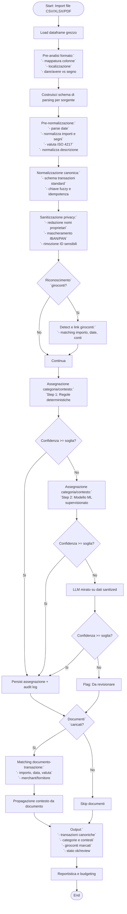

```mermaid
flowchart TD
    A([Start: Import file CSV/XLSX/PDF]) --> B[Load dataframe grezzo]
    B --> C["Pre-analisi formato:`<br/>`- mappatura colonne`<br/>`- localizzazione`<br/>`- dare/avere vs segno"]
    C --> D[Costruisci schema di parsing per sorgente]
    D --> E["Pre-normalizzazione:`<br/>`- parse date`<br/>`- normalizza importi e segni`<br/>`- valuta ISO 4217`<br/>`- normalizza descrizione"]
    E --> F["Normalizzazione canonica:`<br/>`- schema transazioni standard`<br/>`- chiave fuzzy e idempotenza"]
    F --> G["Sanitizzazione privacy:`<br/>`- redazione nomi proprietari`<br/>`- mascheramento IBAN/PAN`<br/>`- rimozione ID sensibili"]
    G --> H{"Riconoscimento`<br/>`giroconti?"}
    H -->|Si| I["Detect e link giroconti:`<br/>`- matching importo, date, conti"]
    H -->|No| J[Continua]
    I --> J
    J --> K["Assegnazione categoria/contesto:`<br/>`Step 1: Regole deterministiche"]
    K --> L{"Confidenza >= soglia?"}
    L -->|Si| M[Persist assegnazione + audit log]
    L -->|No| N["Assegnazione categoria/contesto:`<br/>`Step 2: Modello ML supervisionato"]
    N --> O{"Confidenza >= soglia?"}
    O -->|Si| M
    O -->|No| P[LLM mirato su dati sanitized]
    P --> Q{"Confidenza >= soglia?"}
    Q -->|Si| M
    Q -->|No| R[Flag: Da revisionare]
    M --> S{"Documenti`<br/>`caricati?"}
    R --> S
    S -->|Si| T["Matching documento-transazione:`<br/>`- importo, data, valuta`<br/>`- merchant/fornitore"]
    T --> U[Propagazione contesto da documento]
    S -->|No| V[Skip documenti]
    U --> W["Output:`<br/>`- transazioni canoniche`<br/>`- categorie e contesti`<br/>`- giroconti marcati`<br/>`- stato ok/review"]
    V --> W
    W --> X[Reportistica e budgeting]
    X --> Y([End])

```mermaid

```

    style G fill:#f96,stroke:#333,stroke-width:2px
    style P fill:#bbf,stroke:#333,stroke-width:2px
    style R fill:#f66,stroke:#333,stroke-width:2px
